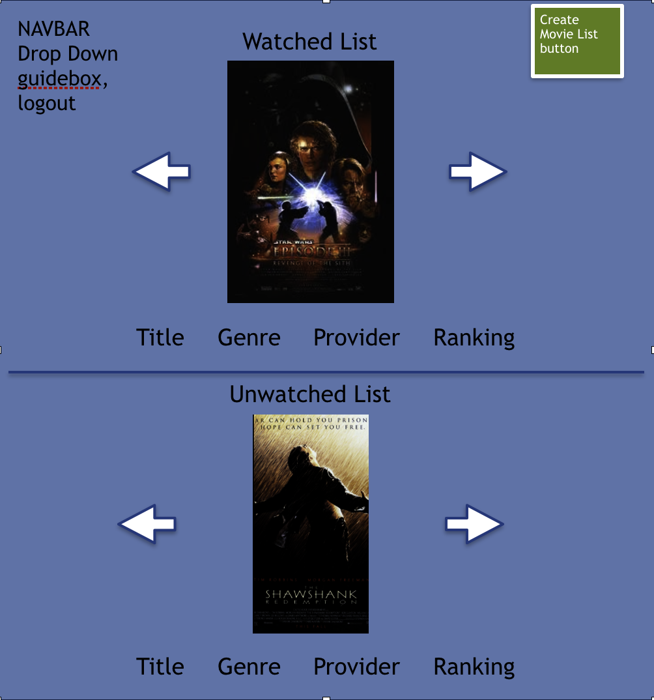
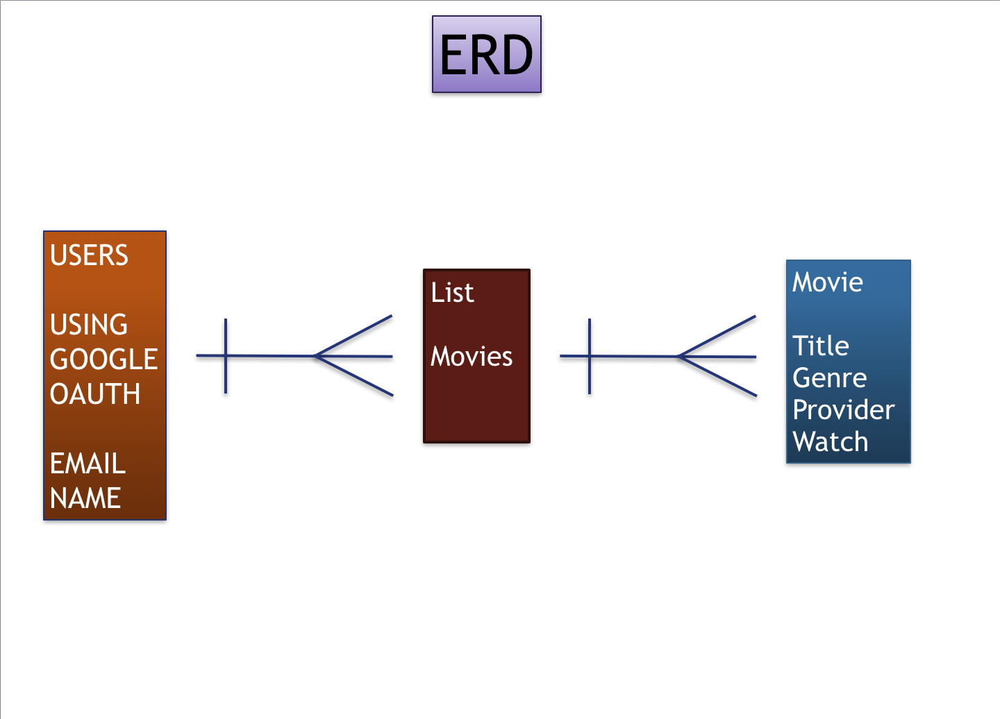

## PROJECT 3 - MovieFindr    

CREATED BY

**Paul Baik**  
**Darin Ma**  
**Gaye Lowenstein**

###DESCRIPTION
__MovieFindr__ is a place to search multiple databases at once to find where a movie is being streamed online.

How often do you think of a movie to watch and then have to search to find if it's on Hulu or Amazon or Netflix?  Wouldn't you love to have a place where you could search multiple databases all at once?  How about storing a list of movies to watch in the future so you don't have to go through an exhausting search each time you want to watch a movie?

###_
Enter **MovieFindr**!
_

###APPROACH TAKEN
Team PaDaGa's approach in building this app was to start off with a Node.js framework using Express for our server side and MongoDB for our database management.  

We divided up the project so that each team member took the lead role as follows:

  Team Leader  | Role
  -----------  | ----------
  Paul         | GitHub Master, Scrum Master
  Darin        | Design Master
  Gaye         | Documentation Master, Database Management

###MVP
* Have a working Google OAuth for users to log on and log off
* Allow users to be able to search, create, edit, update and delete their movie list (full CRUD)
* Allow users to see which providers are showing the movies
* Allow users to check which movies they have watched

###LINKS
[Trello Board Link](https://trello.com/b/QMrl81kr/moviefindr "Trello Board")

###TECHNOLOGIES USED
* __AJAX__ - client side script that communicates with a server/database (Express/MongoDB)
* __EJS__ - client-side templating language to generate HTML with JavaScript
* __Express__ - server side framework to organize our app into MVC architecture
* __GuideBox__ - 3rd party API
* __JavaScript__ - object-oriented computer programming language
* __Materialize__ - responsive CSS framework from Google used for styling
* __MongoDB__ - platform to build our database
* __Node.JS__ - platform to run our Javascript application
* __OAuth__ - allows an end user's account info to be used by 3rd-party services without exposing the user's passwords

###INSTALLATION INSTRUCTIONS

###STRETCH GOALS
